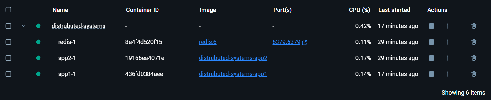
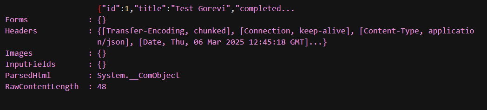
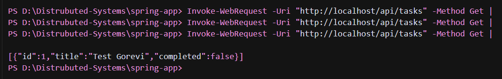
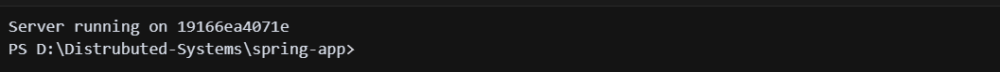
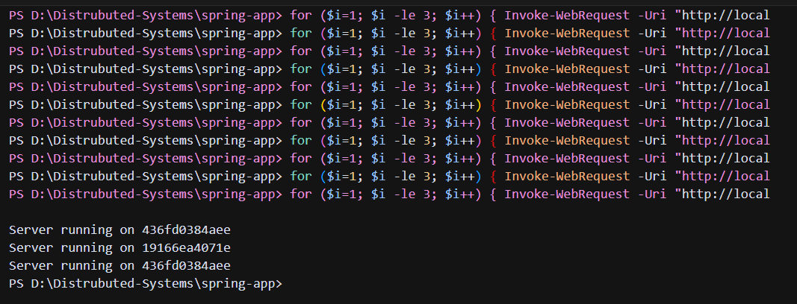
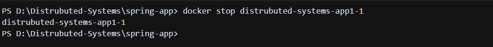
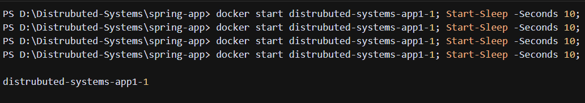
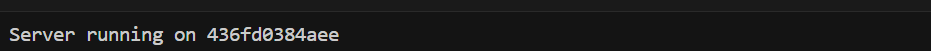

# Distributed Task Management System

Bu proje, Docker teknolojisi kullanılarak oluşturulmuş bir dağıtık sistem mimarisi içerir. Sistem şu bileşenlerden oluşur:

- Nginx (Yük Dengeleyici)
- 2x Spring Boot Uygulaması
- PostgreSQL Veritabanı
- Redis Cache

## Sistem Mimarisi

- **Nginx**: 80 portunda çalışır ve gelen istekleri iki Spring Boot uygulaması arasında dağıtır
- **Spring Boot Uygulamaları**: REST API sunar ve verileri PostgreSQL'de saklar, Redis'i önbellek olarak kullanır
- **PostgreSQL**: Veritabanı sunucusu
- **Redis**: Önbellek sunucusu

## Başlatma

Sistemi başlatmak için:

```bash
docker-compose up --build
```

## API Endpoints

- `GET /api/tasks`: Tüm görevleri listeler
- `POST /api/tasks`: Yeni görev oluşturur
- `GET /api/tasks/server-info`: Hangi sunucunun yanıt verdiğini gösterir

## Adım Adım Test Süreci

### 1. Sistemin Başlatılması
```bash
docker-compose up --build
```

### 2. Çalışan Containerların Kontrolü
```bash
docker ps
```
Bu komut ile tüm servislerin (nginx, app1, app2, postgres, redis) çalıştığını görebilirsiniz.



### 3. Yeni Görev Oluşturma
```powershell
$headers = @{ "Content-Type" = "application/json; charset=utf-8" }
$body = @{ "title" = "Test Gorevi"; "completed" = $false } | ConvertTo-Json
Invoke-WebRequest -Uri "http://localhost/api/tasks" -Method Post -Headers $headers -Body $body
```



### 4. Görevleri Listeleme
```powershell
Invoke-WebRequest -Uri "http://localhost/api/tasks" -Method Get | Select-Object -ExpandProperty Content
```



### 5. Yük Dengeleme Testi
```powershell
# Hangi sunucunun yanıt verdiğini görmek için:
Invoke-WebRequest -Uri "http://localhost/api/tasks/server-info" -Method Get | Select-Object -ExpandProperty Content
```



```powershell
# Birkaç kez çağırarak yük dengelemeyi test etmek için:
for ($i=1; $i -le 3; $i++) { 
    Invoke-WebRequest -Uri "http://localhost/api/tasks/server-info" -Method Get | Select-Object -ExpandProperty Content 
}
```



### 6. Yüksek Erişilebilirlik Testi

#### 6.1. İlk Uygulamayı Durdurma
```powershell
# app1'i durdur
docker stop distrubuted-systems-app1-1

# Sistemin hala çalıştığını kontrol et
Invoke-WebRequest -Uri "http://localhost/api/tasks/server-info" -Method Get | Select-Object -ExpandProperty Content
```



#### 6.2. İkinci Test
```powershell
# app1'i başlat
docker start distrubuted-systems-app1-1

# 10 saniye bekle
Start-Sleep -Seconds 10

# app2'yi durdur
docker stop distrubuted-systems-app2-1

# Sistemin hala çalıştığını kontrol et
Invoke-WebRequest -Uri "http://localhost/api/tasks/server-info" -Method Get | Select-Object -ExpandProperty Content
```




## Yüksek Erişilebilirlik

Sistem, iki Spring Boot uygulaması ile yedekli çalışır. Bir uygulama çökerse, Nginx otomatik olarak diğer uygulamaya yönlendirir. Yukarıdaki test adımlarında görülebileceği gibi, herhangi bir uygulama durdurulduğunda bile sistem çalışmaya devam eder.

